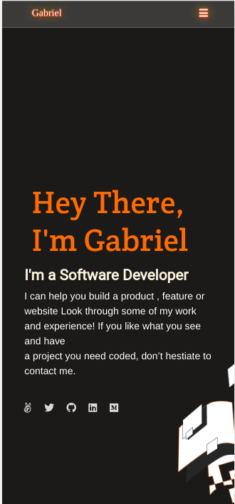

# Portfolio

> My portfolio in 2021. To be updated.

It's a portfolio project and template taken from Figma

## Built With

- HTML
- CSS
- JavaScript

## Live Demo

- [GitHub Link](https://github.com/gabrielcoder247/my-portfolio-v2)

## Getting Started :

### Prerequisites
VS code editor and gitbash

### Setup
 If you like to set up this repository in your local machine the please follow the steps:
 - Click on the repository name
 - Fork it /clone it
 - Use your preferable browser to view /edit it.
 - Just double click on the HTML file to run the project

### Install
   node.js

### Usage
To open the project you can simply download and double click the index.html file

### Deployment
Use an IDE to develop and run it into your browser.

👤 Somdotta Sarkar

- [Github](https://github.com/Somdotta07)
- [LinkedIn](www.linkedin.com/in/somdottasarkar)

## 🤝 Contributing

Contributions, issues, and feature requests are welcome!

Feel free to check the [issues page](../../issues/).

## Show your support

Give a ⭐️ if you like this project!

## Acknowledgments
- Microverse
- Figma
- coding partners

## 📝 License

This project is [MIT](./MIT.md) licensed.
